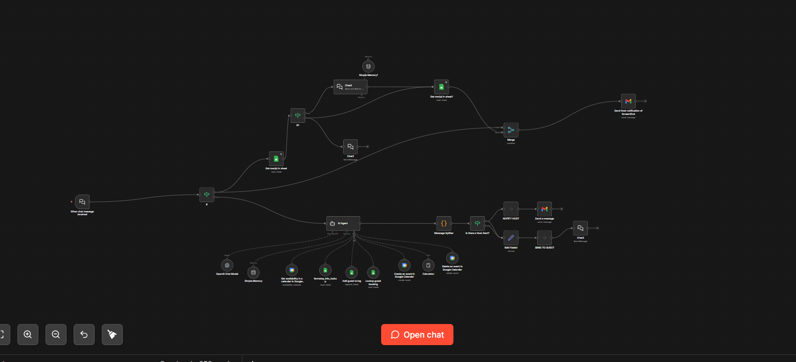
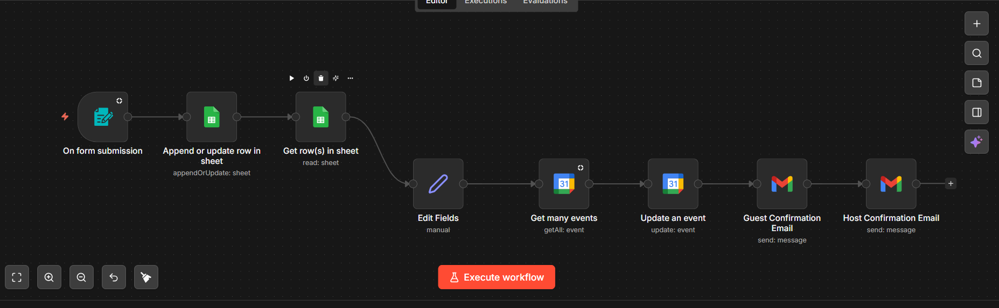

# n8n Production Systems
"High-precision automation workflows for small business operations, featuring AI-driven booking logic, Google Calendar synchronization, and human-in-the-loop approval systems."

---

## 🚀 Featured Workflow: AI Guest Booking System
This system manages the end-to-end lifecycle of a boutique farmstay booking.

### 🧠 The Problem
Manual guest coordination is prone to human error, double-bookings, and delayed responses. This workflow ensures every guest is tracked and every booking is verified before confirmation.

### 🛠️ Key Technical Features
* **Conflict Detection:** Automatically queries the Google Calendar API to prevent overlapping stays.
* **Human-in-the-Loop:** Uses n8n 'Wait' nodes to pause execution until a host provides manual approval via a webhook.
* **Dynamic Data Formatting:** Uses custom expressions to transform raw form data into clean, calendar-ready events.
* **Automated Notifications:** Triggers personalized emails upon approval/rejection.

### 📂 How to Import
1. Navigate to the `/workflows` folder in this repo.
2. Download the `.json` file.
3. In your n8n instance, click **Import from File** and select the downloaded JSON.
4. Add your specific Google Calendar and Email credentials.

---

## 🛠️ Tech Stack
* **Orchestration:** n8n
* **Integrations:** Google Calendar, Gmail, OpenAI
* **Logic:** JavaScript (n8n Expressions), Webhooks

##Preview

## 👤 About AI-Sapiens
Focusing on zero-hallucination AI logic and technical precision in workflow automation.
